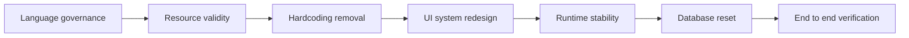
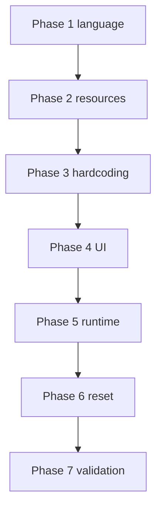

# AI Education System Remediation Plan

## Confirmed Product Direction

- Learning artifacts must use strict target language content
  - Questions, answers, passages, speaking prompts, writing prompts, and model answers
- UI chrome stays in English
- Visual design direction is a modern institute feel in blue/slate tones
- No hardcoded topic bias and no fake resource links
- Clean database reset before fresh validation run

---

## Current Gaps Found

1. Language leakage in generated exercises and assessments
2. Hallucinated or invalid resource links especially YouTube
3. Hardcoded demo and topic biased values in admissions and seed paths
4. Inconsistent UI patterns across pages
5. Runtime instability around program route behavior and stale build references
6. Database state contamination from earlier runs

---

## Execution Blueprint

---

## Phase 1 - Language Governance and Schema Contract

### Goals

- Introduce explicit language controls into onboarding profile and program artifacts
- Enforce target language in learner facing generated content

### Changes

1. Extend onboarding schema with language directives
   - Add fields for content language and instruction language
   - Persist directives in program generation inputs
2. Update admissions flow to collect language directive early
3. Propagate language directive through all relevant agents
   - Curriculum Architect
   - Lesson Builder
   - Exercise Generator
   - Assessment Office
4. Update deterministic fallback generators so fallback content also respects target language
5. Add language QA repair pass
   - Detect mismatch in learner facing text fields
   - Regenerate with strict rewrite prompt while preserving schema

### Acceptance Criteria

- For a German program all learner facing exercise and assessment text is German
- UI remains English labels and navigation
- Schema validation still passes after language repair retries

---

## Phase 2 - Resource Reliability and Link Validity

### Goals

- Stop accepting model invented links
- Only persist resources that pass URL validity checks

### Changes

1. Split resource pipeline into retrieval and ranking
   - Retrieval uses search queries
   - Ranking uses quality and relevance scoring
2. Implement URL validation layer before persistence
   - Generic URL parse and network reachability checks
   - YouTube specific video id normalization and availability verification
3. Enforce minimum valid resources per lesson
   - Retry curation if threshold is not met
4. Persist validation metadata with each resource
   - Validation status
   - Retrieval timestamp
   - Scoring inputs

### Acceptance Criteria

- Lesson resources open successfully for sampled lessons
- Invalid or placeholder YouTube links are rejected before save
- Curator output remains schema compliant with quality justification

---

## Phase 3 - Remove Hardcoding and Topic Bias

### Goals

- Remove static demo identity assumptions and topic specific examples from generation prompts

### Changes

1. Replace hardcoded admissions demo creation with neutral local user resolution strategy
2. Remove topic specific prompt examples that bias outputs
3. Update seed behavior to optional neutral bootstrap only
4. Ensure admissions questions are subject agnostic and not language only framed

### Acceptance Criteria

- Starting admissions does not inject German specific assumptions
- Program generation works for non language topics and language topics alike

---

## Phase 4 - Modern Institute UI Redesign

### Goals

- Establish a consistent, modern, school like product surface

### Changes

1. Build shared UI foundation
   - App shell with consistent header and section rhythm
   - Reusable cards, badges, progress bars, list rows, and empty states
   - Blue/slate visual tokens with clear contrast hierarchy
2. Standardize page information architecture
   - Dashboard
   - Admissions
   - Programs and program detail
   - Calendar
   - Lesson classroom
   - Practice lab
   - Assessment room
   - Gradebook and review
3. Improve state clarity
   - Not started
   - In progress
   - Submitted
   - Graded
4. Keep tutor as contextual side support and not main canvas

### Acceptance Criteria

- All major pages share coherent typography spacing and component behavior
- Page level state visibility is consistent everywhere
- UI communicates institute workflow not chatbot workflow

---

## Phase 5 - Runtime Stability and Route Hygiene

### Goals

- Eliminate current route generation and stale job reference regressions

### Changes

1. Correct dynamic route handler signatures and static path usage patterns
2. Remove or adjust fragile static params behavior where runtime data is required
3. Harden build reconnection logic against deleted or stale program ids
4. Add defensive 404 handling for previously persisted client state

### Acceptance Criteria

- No repeated runtime errors around program route access in dev logs
- Reconnect behavior gracefully handles stale ids without UI breakage

---

## Phase 6 - Database Reset and Fresh Start Protocol

### Goals

- Provide deterministic clean start workflow for local development and QA

### Changes

1. Add a documented safe reset command set for SQLite and Prisma
2. Clear existing generated artifacts and stale build jobs
3. Recreate schema and regenerate Prisma client
4. Keep optional minimal bootstrap data neutral

### Acceptance Criteria

- Fresh run starts with empty learning data state
- Admissions to program generation works from scratch without manual DB edits

---

## Phase 7 - End to End Validation and Checklist Sync

### Goals

- Validate the full virtual school journey after all remediation changes

### Validation Runs

1. Language path run
   - German target language content enforcement check
2. Non language path run
   - Topic agnostic onboarding and generation behavior check
3. Resource validity sampling
   - Open curated links from multiple lessons
4. UI consistency review
   - Dashboard through review center visual and state consistency

### Final Updates

- Update CHECKLIST file with completed remediation work
- Update docs for language policy resource validation and reset flow

---

## Implementation Order Summary

1. Language schema and propagation
2. Resource validity pipeline
3. Hardcoding cleanup
4. UI foundation and page rollout
5. Runtime bug fixes
6. DB reset and fresh validation
7. Checklist and documentation closeout

